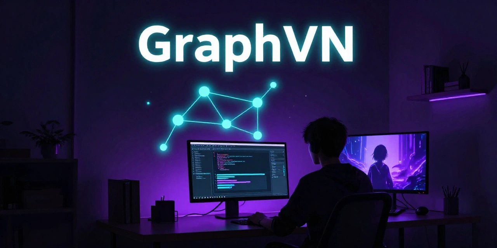

An AI-powered Cross-platform Visual Novel Engine built with Flutter.

<a href="https://github.com/flutter/flutter">

---

> ⚠️ **Proof-of-Concept / Experimental**
> GraphVN is **not ready for creating real games**. It is a concept prototype — features are incomplete, breaking changes happen frequently, and data loss is possible. Use it only to evaluate the idea.

---

## What is GraphVN?

**GraphVN** is a game engine and companion editor designed specifically for creating visual novels and puzzle-driven text adventures. Instead of writing scripts, you build your story as a **graph**: nodes connected by transitions, drawn on an interactive canvas. All game logic — actions, conditions, dynamic text insertions — is written in **plain natural language**. The engine translates it into executable code behind the scenes.

Want the player's health to increase by 50 when they enter a room? Just type _"increase player health by 50"_. Want to show how many coins the player has in the middle of a sentence? Type `{{ show coins }}` and the engine fills in the value. No scripting. No boilerplate.

This is early-stage software — rough around the edges, actively changing, and full of potential.

---

## Features

- 🎨 **No-Code Graph Editor** — drag, connect, rearrange. Nodes and transitions on an infinite canvas. Everything is visual.
- 🤖 **Natural Language Logic** — write conditions and actions in your own language. The engine generates the code automatically.
- 🖼 **AI Image Generation** — generate backgrounds and sprites from text prompts right inside the editor.
- 🧩 **Flexible Variable System** — numbers, named values (enums), grouped in folders. Any game data you need.
- 🌍 **Cross-Platform** — Windows, macOS, Linux, Android, iOS — one Flutter codebase.

---

## Quick Start

GraphVN offers two paths — create your own story, or dive straight into someone else's. Pick the one that fits you.

### 🛠 Create a Quest

1. **Download the binary** — grab the latest release for your platform from the [releases page](https://github.com/rabbitspixy/GraphVN/releases) and unzip it.
2. **Open the editor** — Launch GraphVN and click **Editor**.
3. **Start a new project** — give it a name and land on a fresh, infinite canvas.
4. **Build your story** — place nodes and connect them with transitions to shape your narrative.
5. **Playtest instantly** — press **F1** to flip into play mode and experience what you've built. Press **F1** again to return to the editor and keep refining.

### 🎮 Play a Quest

1. **Download the binary** — grab the latest release for your platform from the [releases page](https://github.com/rabbitspixy/GraphVN/releases) and unzip it.
2. **Add a quest** — drop the quest `.zip` file into the `games/` folder. No such folder yet? Create one right next to the GraphVN binary.
3. **Launch GraphVN** — click **Play**.
4. **Select and enjoy** — choose a quest from the list and jump right in.

---

## Why GraphVN?

- **Zero scripting** — content creators don't need to learn a programming language. Just write what you want to happen.
- **Local AI** — image generation and code generation run entirely on your hardware. No cloud bills, no data leaving your machine.

---

## Roadmap

- **🌐 Multi-language UI** — translate the editor interface into multiple languages.
- **🖥 Linux & macOS Editor** — full editor releases for Linux and macOS (Android and iOS in read-only playback mode only).
- **📦 Quest Export as ZIP** — package a complete quest into a single ZIP archive for distribution and playback.
- **💾 Save System** — save/load game progress with multiple slots.
- **🎨 Improved AI Generation** — better image generation and code generation quality.
- **🖼 Background Editor** — create layered backgrounds with parallax and animations.
